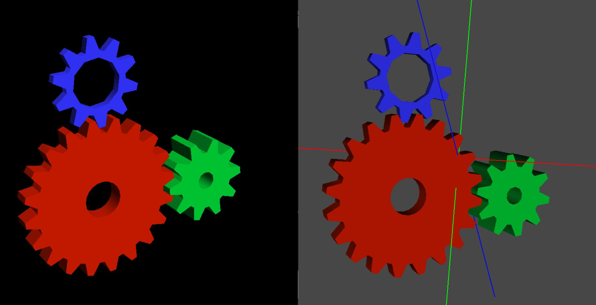

# GLStream

This project is forked from [Github](https://github.com/rpavlik/chromium)
and the original project can be found here [Sourceforge](http://chromium.sourceforge.net/)
This project takes any GL 2.0 application and creates an OpenScreenGraph or a model in Unreal Engine in realtime.

## Screenshot



## Getting Started

The project supports Windows x64 and x86 architecture.
Install Cmake and svn add them to your system path.
Run 
```
FetchExternalDeps.bat
```
or download windows dependencies from [here](https://icedrive.net/1/50TNdyuKTn) and put them in ExternalLibrary folder
then edit "initTransViz.bat" and set OSGRoot variable with path till sub directory "ExternalLibrary" 
```
then run initTransViz.bat" which will generate  microsoft visual studio solution file "TransViz"
```
Then double click on "TransViz" solution file then visual studio will load your project.

And then build the project.

### Prerequisites [TODO]

What things you need to install the software and how to install them

```
Give examples
```

### Installing

A step by step series of examples that tell you how to get a development env running

Say what the step will be

```
Give the example
```

And repeat

```
until finished
```

End with an example of getting some data out of the system or using it for a little demo

## Running the tests

Explain how to run the automated tests for this system

### Break down into end to end tests

Explain what these tests test and why

```
Give an example
```

### And coding style tests

Explain what these tests test and why

```
Give an example
```

## Deployment

Add additional notes about how to deploy this on a live system

## Built With

* [Visual Studio](https://visualstudio.microsoft.com/) - Core
* [Python](https://www.python.org/) - Dependency Management
* [GLUT](https://www.opengl.org/resources/libraries/glut/) - Open GL Library

## Contributing

Please read [CONTRIBUTING.md](https://gist.github.com/PurpleBooth/b24679402957c63ec426) for details on our code of conduct, and the process for submitting pull requests to us.

## Versioning

We use [SemVer](http://semver.org/) for versioning. For the versions available, see the [tags on this repository](https://github.com/your/project/tags). 

## Authors

* **Naman Gupta** - *Initial work*

See also the list of [contributors](https://github.com/your/project/contributors) who participated in this project.

## License

This project is licensed under the MIT License - see the [LICENSE.md](LICENSE.md) file for details

## Acknowledgments

* Hat tip to anyone whose code was used
* Inspiration
* etc
